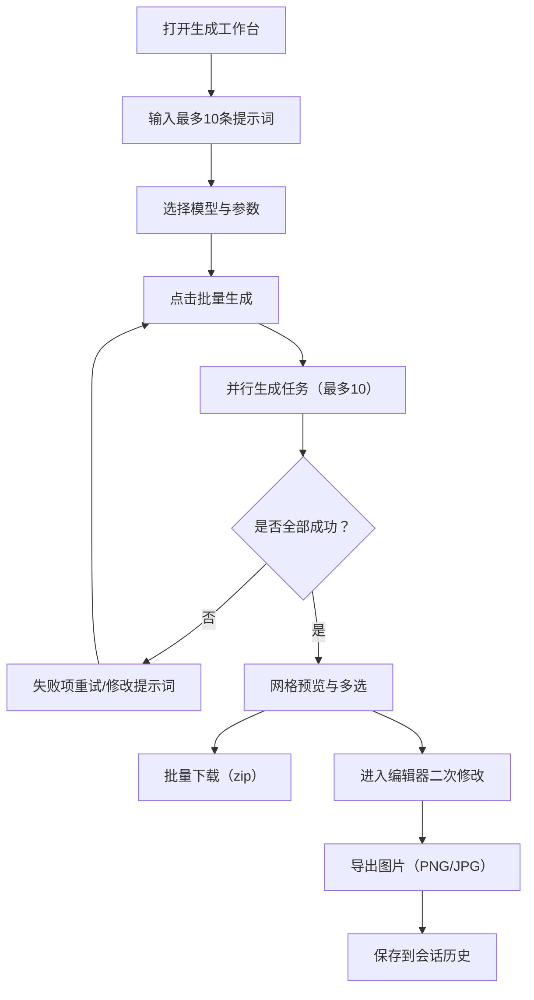

## 1. 产品概述
为个人创作者提供一个可同时输入最多10条提示词、并行生成小红书封面图片的工作台，支持模型选择（image2 / nano-banana）、批量下载与二次编辑，从而快速产出大量可复用封面模板。
- 解决的问题：手工逐张生成与下载耗时、模板迭代慢、批量提示词管理混乱
- 目标用户：需要高频产出小红书封面/模板的个人创作者与小团队运营
- 产品价值：把“提示词微调 → 批量生成 → 挑选/编辑 → 批量导出”压缩成一次工作流

## 2. 核心功能

### 2.1 功能模块
1. **生成工作台**：提示词批量输入、模型选择、并行生成、生成队列/状态、结果预览、批量下载
2. **编辑与图库**：单张编辑（裁切/文字/贴纸/滤镜/调色/简单布局）、版本/撤销、导出、历史记录管理（本地/会话级）
3. **连接与配置**：柏拉图渠道配置（API Key）、并发上限与默认参数、失败重试策略

### 2.2 页面详情
| 页面名称 | 模块名称 | 功能描述 |
|---|---|---|
| 生成工作台 | 提示词批量输入 | 支持一次最多10条；支持“逐行输入/粘贴”；支持快速复制上一条并做局部修改；支持一键清空 |
| 生成工作台 | 模型选择与参数 | 选择 image2 / nano-banana；可扩展参数（尺寸、风格等）以抽屉形式展示；设置可作为默认值 |
| 生成工作台 | 批量生成与并发 | 点击批量生成后同时启动最多10个任务；展示每条提示词的状态（排队/生成中/成功/失败）与进度；失败支持单条重试/全部重试 |
| 生成工作台 | 结果预览与选中 | 网格缩略图预览；支持多选/全选；支持点击进入编辑页；支持复制提示词到剪贴板 |
| 生成工作台 | 批量下载 | 支持将选中结果打包下载（zip）；支持命名规则（序号_模型_时间_前缀） |
| 编辑与图库 | 图片编辑器 | 基于画布编辑：裁切、缩放、旋转；文字（字体/描边/阴影/行距）；简单形状/贴纸；基础滤镜与调色；对齐/层级；导出 PNG/JPG |
| 编辑与图库 | 历史记录 | 按会话保存生成记录（提示词、模型、时间、图片）；支持筛选与删除；支持批量导出 |
| 连接与配置 | 柏拉图配置 | 填写/更新 API Key（仅本地保存或仅服务端保存，默认不落盘明文）；测试连接；选择默认模型 |

## 3. 核心流程
1. 用户在“生成工作台”粘贴或逐行填写提示词（最多10条）
2. 选择模型（image2 / nano-banana）及可选参数
3. 点击“批量生成”，系统并行启动任务并持续更新状态
4. 生成完成后用户多选结果：批量下载，或单击进入编辑器做二次修改
5. 编辑完成后导出，并在“编辑与图库”里保留会话历史，便于复用模板

## 4. 用户界面设计

### 4.1 设计风格
- 视觉调性：偏“工作台 + 设计工具”气质，强调效率与可控感
- 主色：深色背景 + 高饱和强调色（用于进度、成功/失败态、主要按钮）
- 字体：标题使用更具展示感的字体，正文使用可读性高的无衬线字体
- 布局：左侧输入区 + 右侧预览网格，编辑器采用“画布居中 + 右侧属性面板”的熟悉范式
- 动效：生成时的进度与骨架屏；结果出现的轻微弹性/渐入；按钮 hover 反馈明显

### 4.2 页面设计概览
| 页面名称 | 模块名称 | UI 元素 |
|---|---|---|
| 生成工作台 | 输入与控制区 | 多行输入框（支持逐行）；提示词计数与校验；模型单选卡；高级参数抽屉；“批量生成/全部重试/清空”主操作 |
| 生成工作台 | 状态列表 | 每条提示词一行：状态徽标、进度条、用时、错误提示、单条重试按钮 |
| 生成工作台 | 结果网格 | 缩略图卡片：勾选、多选、放大预览、复制提示词、进入编辑；底部批量下载条 |
| 编辑与图库 | 编辑器 | 画布、缩放控制、对齐辅助线；右侧属性面板（文字/滤镜/图层）；顶部导出与返回 |
| 编辑与图库 | 历史 | 时间线或卡片列表；按模型/日期筛选；批量勾选导出/删除 |

### 4.3 响应式
- 默认桌面优先（推荐 ≥ 1280px 宽度）
- 移动端：只保留“生成 + 预览 + 单张编辑”的简化模式；批量操作折叠为底部工具栏

