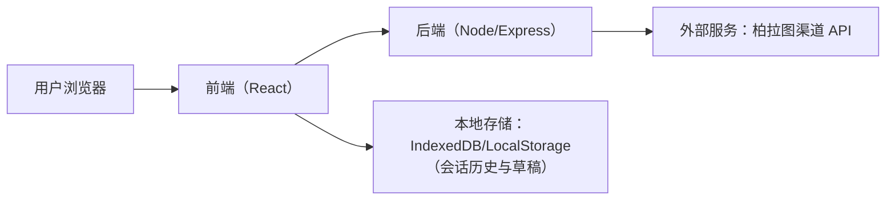
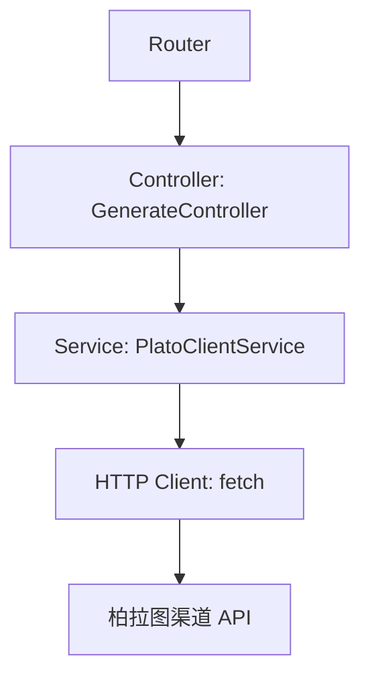
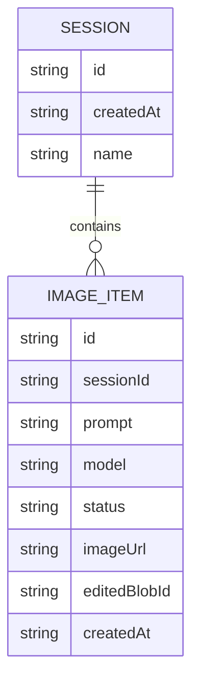

## 1. 架构设计



## 2. 技术说明
- 前端：React@18 + TypeScript + vite
- 样式：tailwindcss@3（配合少量自定义 CSS 变量实现主题与动效）
- 状态管理：React 内置 state + 轻量 store（优先不引入大型状态库）
- 编辑能力：前端 Canvas（2D）实现基础编辑；导出为 PNG/JPG
- 后端：Express@4（仅做 API Key 隔离与请求转发，避免在浏览器暴露密钥）
- 数据：默认不接数据库；会话历史与编辑草稿存 IndexedDB（可选）

## 3. 路由定义
| 路由 | 用途 |
|---|---|
| / | 生成工作台（批量输入/生成/预览/批量下载） |
| /editor/:id | 编辑器（基于生成结果进行二次编辑与导出） |
| /library | 会话图库与历史记录管理 |
| /settings | 渠道配置与默认参数（API Key、默认模型、并发上限） |

## 4. API 定义

### 4.1 类型定义（前端/后端共享）
```ts
export type ModelName = 'image2' | 'nano-banana'

export type GenerateRequest = {
  prompts: string[]
  model: ModelName
  size?: { width: number; height: number }
  seed?: number
  extra?: Record<string, unknown>
}

export type GenerateTaskStatus =
  | 'queued'
  | 'running'
  | 'succeeded'
  | 'failed'

export type GenerateResultItem = {
  id: string
  prompt: string
  model: ModelName
  status: GenerateTaskStatus
  imageUrl?: string
  errorMessage?: string
  createdAt: string
}

export type GenerateResponse = {
  items: GenerateResultItem[]
}
```

### 4.2 接口列表（后端）
| 方法 | 路径 | 说明 |
|---|---|---|
| POST | /api/generate | 批量生成：接收 prompts（<=10）、model 与参数；后端并发调用柏拉图并返回每条结果 |
| GET | /api/image | 图片代理（可选）：用于将外部图片转为同源可下载/可编辑（避免 CORS） |
| GET | /api/health | 健康检查/连通性测试（用于设置页“测试连接”） |

### 4.3 错误约定
```ts
export type ApiError = {
  code: string
  message: string
  details?: unknown
}
```

## 5. 服务端架构图



## 6. 数据模型（可选：IndexedDB）

### 6.1 数据模型定义


